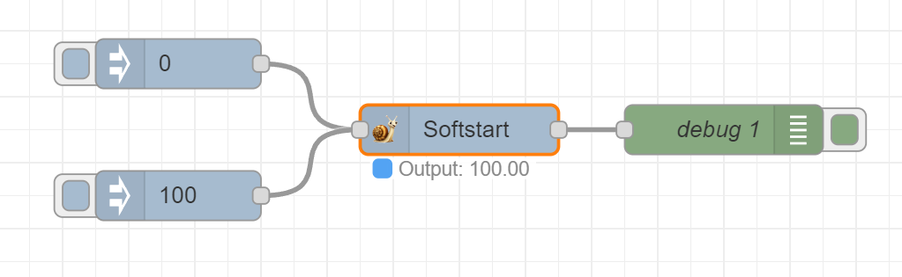
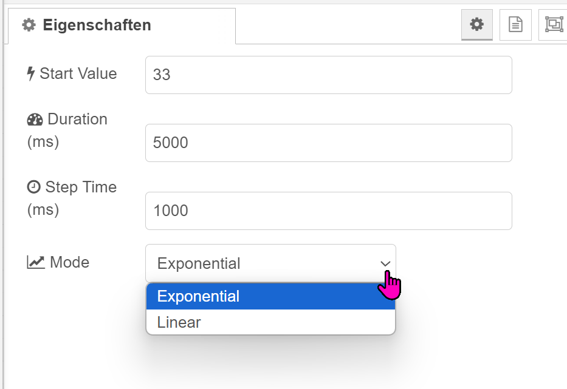

# Softstart

- Approach to a new value from a current value
- Supports linear and exponential interpolation
- Initial value is configurable
- Time is configurable
- Step period is configurable
- Current output value as status
- !!! Exponential mode does not work with negative values !!!

